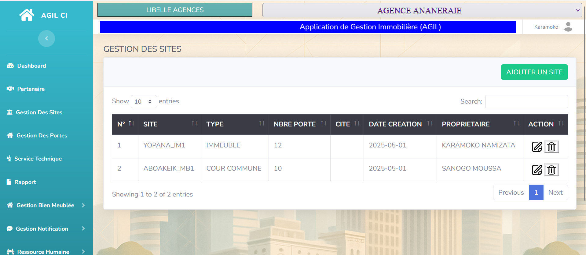
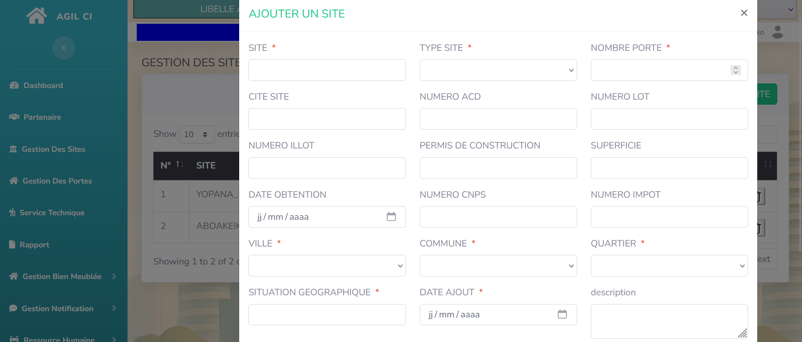
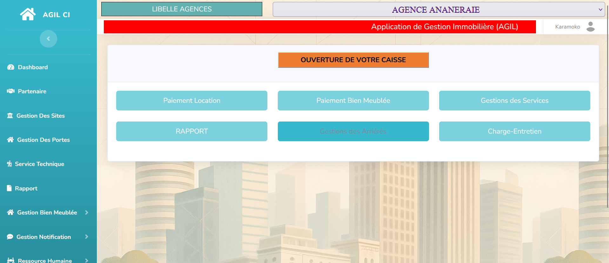
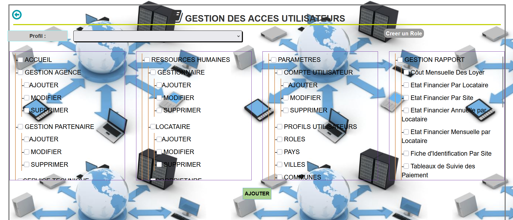

\# 🏢 Application de Gestion Immobilière - Java EE


Ce projet est une application de \*\*gestion immobilière\*\* développée avec \*\*Java EE\*\* sous Eclipse, permettant de gérer les biens, les clients, les contrats, les locations et les paiements.


\## 📌 Fonctionnalités principales


\- 🏠 Gestion des biens immobiliers (appartements, maisons, etc.)

\- 👥 Gestion des clients et propriétaires

\- 🧾 Gestion des contrats de location

\- 💰 Enregistrement des paiements

\- 📊 Tableau de bord et statistiques (optionnel)

\- 🔐 Authentification des utilisateurs (selon rôles)

\- 📁 Export de données (optionnel)

## 🖼️ Aperçu de l'application

### Page Login


### Page Logins


### Tableau de bord


### Page liste_site


### Page ajout_site


### Page comptabilite


### Page gestion_acces



\## ⚙️ Technologies utilisées


| Technologie      | Description                          |

|------------------|--------------------------------------|

| Java EE          | Servlets, JSP, JSTL                  |

| Eclipse IDE      | Environnement de développement       |

| Tomcat (ou autre) | Serveur d'application                |

| MySQL Workbench  | Conception et gestion de la base de données |

| JDBC             | Connexion entre Java et MySQL        |

| HTML / CSS / JS  | Interface utilisateur                |

| Bootstrap (si utilisé) | Mise en forme et design responsive |


\## 🛠️ Pré-requis


\- \[Eclipse IDE](https://www.eclipse.org/downloads/)

\- \[Apache Tomcat](https://tomcat.apache.org/)

\- \[MySQL](https://dev.mysql.com/downloads/)

\- \[MySQL Workbench](https://www.mysql.com/products/workbench/)

\- Navigateur Web moderne


\## 🚀 Installation \& lancement


1\. \*\*Cloner le projet :\*\*


```bash

git clone https://github.com/Berthe1997/gestion-immobilier.git


